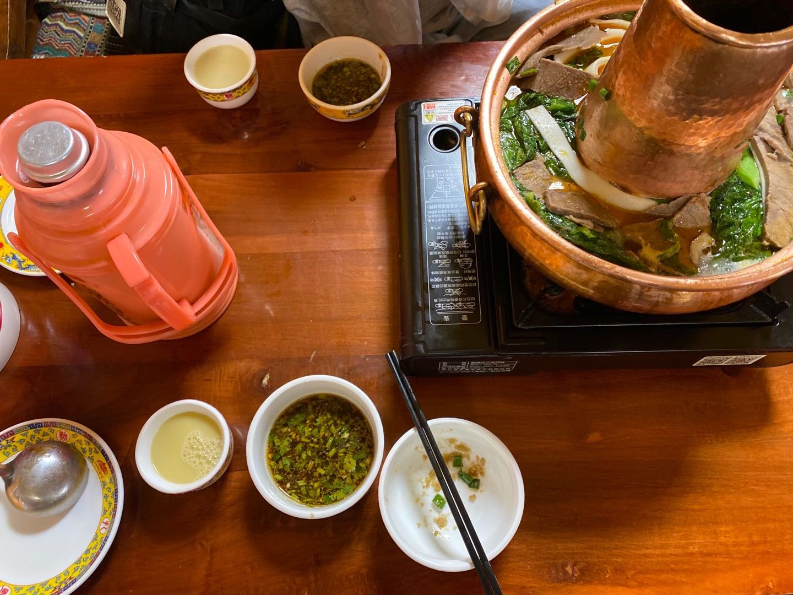
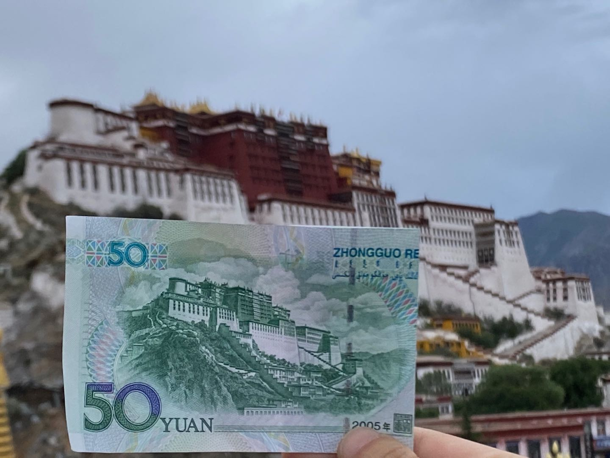
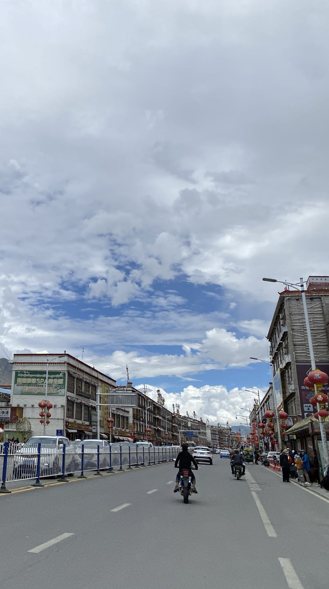
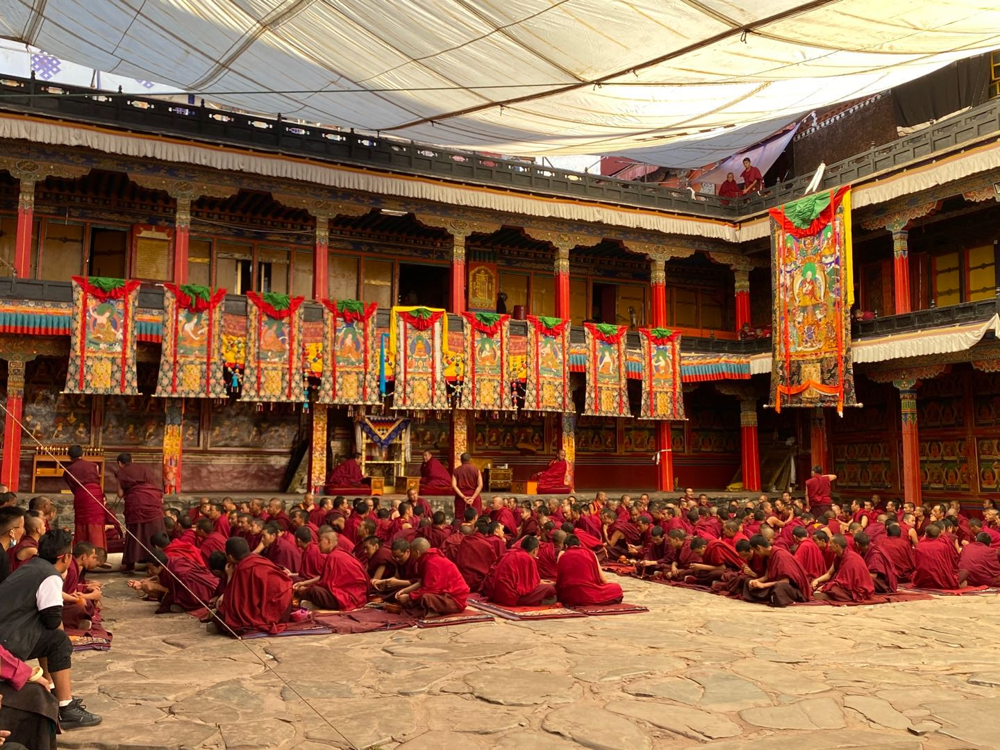
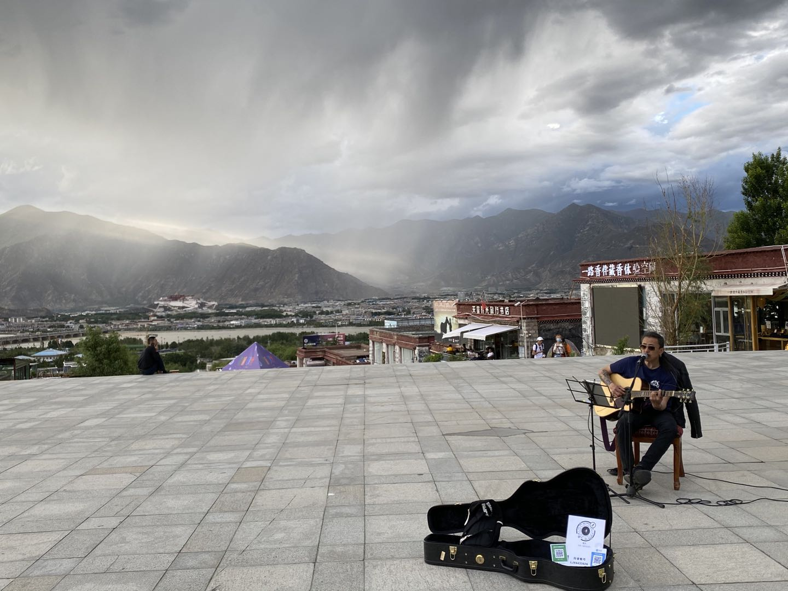
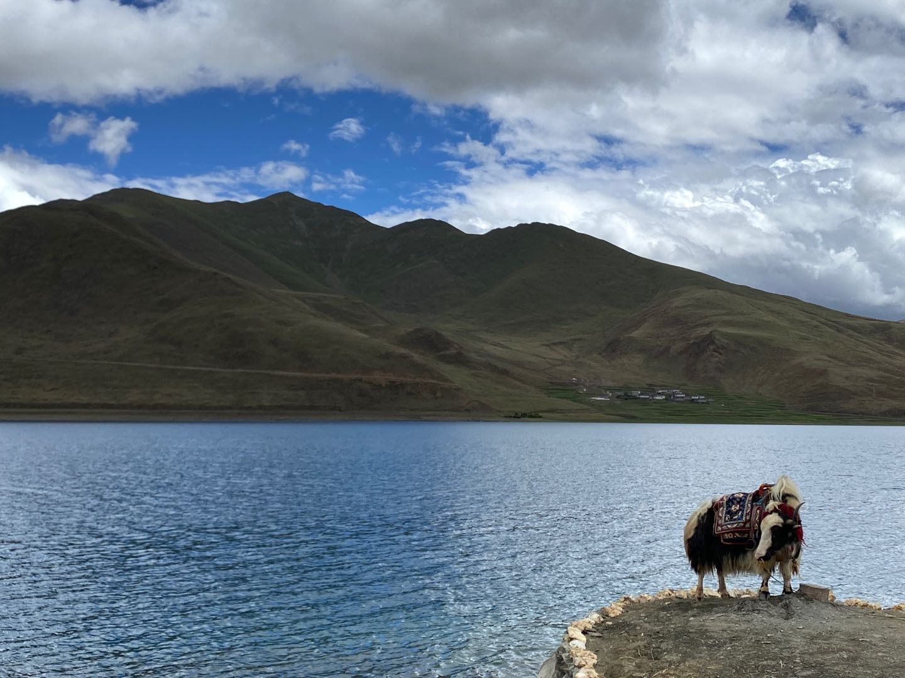
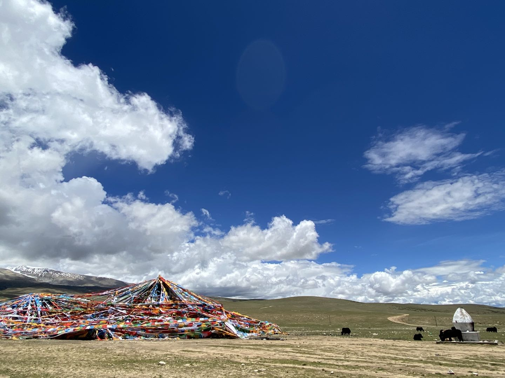
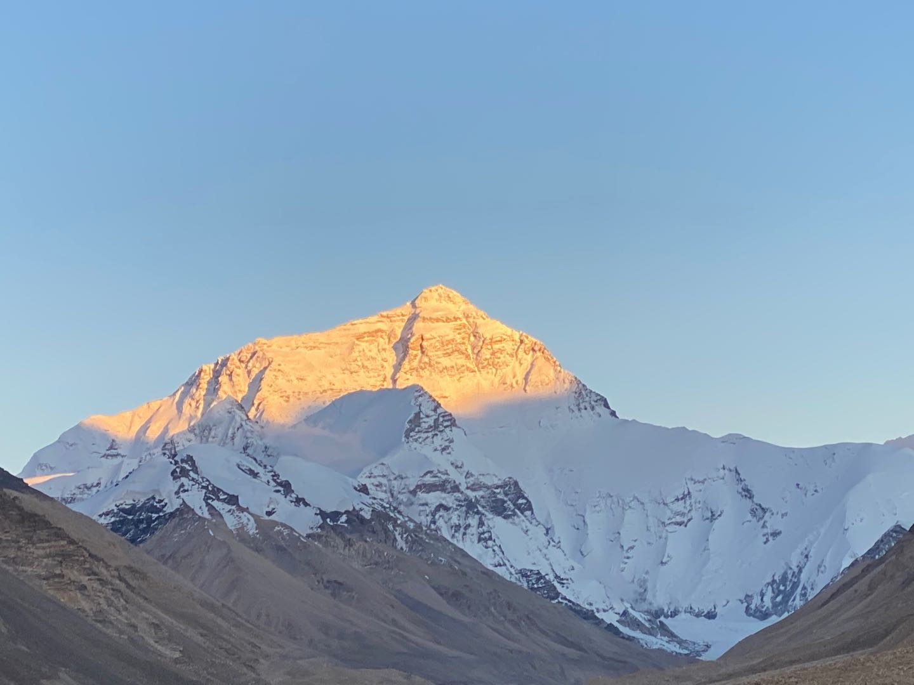
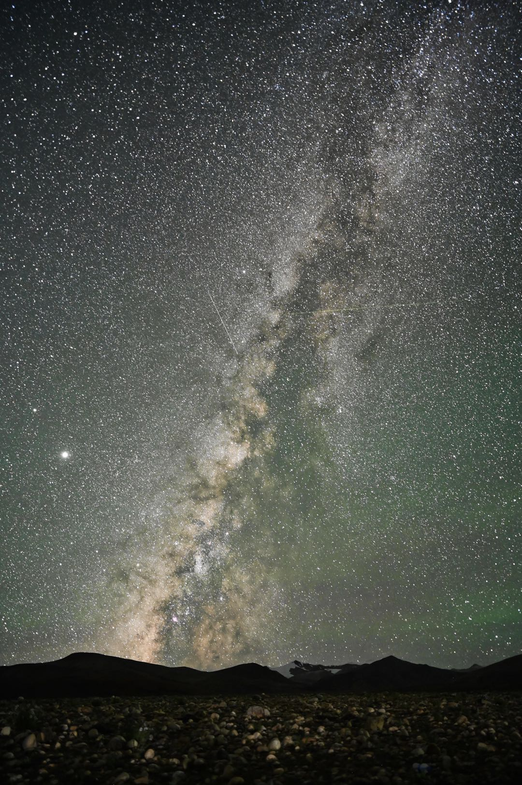

# 西藏，扎西德勒
### 有缘进藏
五年前，听到中科院科考队写的一首歌《不一样的纳木措》，对纳木措心驰神往。四年前，朋友推荐了一本书《西藏生死书》，对西藏的人生观充满好奇。两年前，看了《冈仁波齐》，惊讶朝圣者的虔诚与坚韧。终于，有幸在毕业季相约西藏。

### 衣食住行
整个旅程很简单，乘坐有氧列车到达拉萨后，分别通过两条线路理解这个神秘的地方，宗教文化线：布达拉宫、哲蚌寺、大昭寺、文成公主下嫁西藏演出和扎什伦布寺，景点观光线：纳木措、珠峰大本营（海拔5200米）、羊卓雍措、唐古拉山口和雅鲁藏布江。

宗教线多请导游解说，景点线多准备点增强免疫力的药物，因为对于很多人游客来说，眼睛在天堂，身体在地狱。西藏以川菜为主，但是你可选择吃口味淡一点的食物，早晨跟着藏民喝一碗酥油茶，中、下午可以尝尝甜茶，藏饼、藏面、青稞饼和牦牛火锅都是不错的选择。

我去的时候是六月底，如果要去高海拔地区看日落和星空，建议带上冬季的衣服，高地的风很大，感冒和发烧在高原是非常危险的。住宿在西藏还是比较方便的，拉萨基本上就是现代化的大城市，如果去珠峰和纳木措，会住大通铺和大帐篷，大家挤一挤还是蛮有趣的。最后，建议带一些必备药品，比如晕车药、高原药和增强免疫力药物。
### 别样旅途
我是坐火车从上海直达拉萨的，在火车上了解到不少关于西藏的知识。记忆犹新的是一个故事，是《神的孩子都要去西藏》的前言讲述的一件小事，作者开车去西藏时，被一个西藏小姑娘拦住，问是不是去拉萨，被告知去拉萨后，小姑娘拿了2000元钱，希望司机能帮忙捎给在拉萨的哥哥。

我到拉萨就直奔布达拉宫，看到无数藏民已经拿着转经筒围着心中的圣地转寺了。在西藏的寺庙里，香火钱是可以找零的，地上有一堆零钱，僧人用扫把堆在角落，有需要可以自行找零，全程无人监督。西藏以前是一个农奴制政教合一的地区，那时布达拉宫是西藏的宗教和权力中心。但现在仅仅作为僧人供奉的寺庙，里面有几世达赖喇嘛的灵塔（据说肉身都在灵塔内）和佛像。

西藏的商业街很特别，有各种西藏本土的小玩意儿，鸡血藤手镯、狰狞的面具、蜜蜡和酥油灯，店主闲暇时都会拿着藏经诵读。路边随处可见用身体丈量心中朝圣之路的人们，过路的藏民会捐一些零钱给朝圣者。即使身体健全的乞讨者（身上挂一个念经的收音机），也会有人施舍，没人担心受骗上当。哲蚌寺据说是修建布达拉宫之前达赖喇嘛居住的寺庙，也是拉萨最大的寺庙。里面的僧人们都很友善，念经的僧人喝水时，顺便给路过的藏民小朋友倒了一杯。寺庙的贡品中，我发现了一大盒棒棒糖。扎实伦布寺中供奉的是历代班禅大师的金塔，有幸在这里看到了辩经，据说他们在用藏语讨论哲学问题，大家尽情“刁难”被问者，问询者一副胸有成竹趾高气昂的架势，场面热闹随意。

晚霞时分，在文成公主演出广场上，背靠群山，听流浪歌手唱老狼的歌曲。旁边小店里有一个卖陨石的大叔，自称伍子胥的后人，说每年要花一半时间去各地收集陨石。在露天站台观看文成公主表演时，忽然雷雨交加，距离天堂最近的地方，闪电都那么真实。演员们冒雨完成表演。

水葬在当地虽然已经被禁止，但毕竟已传承多年，所以当地人是不吃鱼的。现在99%的藏民都是天葬。西藏旅途中的基础设施少，物资较缺乏，所以旅途中少见厕所，撒尿基本对着雪山，拉屎则躲在草原。只有远处的风马旗和玛尼堆告诉我这里有人类文明的痕迹，我不是原始人。

 

有厕所的地方，藏民会问你要2元钱，如果没有现金用食物代替也是可以的，半盒饼干或者一罐饮料都是不错的代替品。路上有位藏民想要花5元钱购买同伴的听装可乐，眼神非常执着。

在珠峰大本营拿着望远镜眺望珠峰，真实感受世界屋脊的存在。在寒风中蜷缩3个小时，就为了黄昏的金色点缀山脊的样子。观看日落下来，住在海拔4700米的藏民村里，只有泡面的夜宵也是美味。美景永远留给准备好的人。每个小时起床一次，等待月亮和乌云离去。终于，在5点钟，星海降临人间，不时有流星穿越星云。

### 困惑
如果说我是带着探秘的态度上西藏的话，那离开西藏的时候我只带走了问号和感叹号。比如，高原药和氧气瓶在高原是不是真的能够缓解高原反应？珠峰旅程中，100元上下的菊石化石是不是真的？西藏的本土宗教一直是苯教，为什么藏民能够如此虔诚信仰从印度发源的佛教一千年？达赖喇嘛和班禅大师都来自藏传佛教的格鲁派，两位大师在西藏政治权力方面是什么关系？据说西藏地区平均寿命较短，是真的吗？是什么原因导致的？（我的司机师傅说，虽然他看上去有50岁，其实今年他只有40岁）藏红花真的是西藏的特产吗？等等等等。

### 结语
西藏，你依然远离凡尘至纯至净，我们有缘再见。
